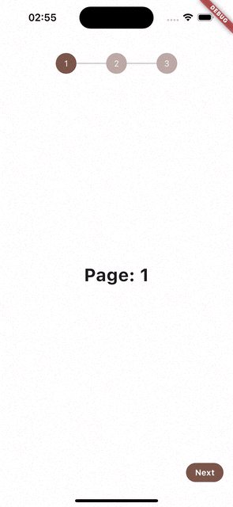

A Simple and easily customizable widget for creating a page stepper with indicators to navigate through pages.

## Features

Customizable: Customize the appearance of the stepper and indicators.

Flexible: Supports any number of steps/pages.



## Usage
Install dependency and Import the package using(Check Installing tab for more info)
```dart
import 'package:flutter_page_stepper/flutter_page_stepper.dart';
```
Add the FlutterPageStepper into your code by setting the active color, stepperLength(number of pages), currentIndex, and a List of pages you will like to display
```dart
FlutterPageStepper(
        activeColor: Colors.brown,
        stepperLength: 3,
        currentIndex: currentPage,
        children: const [
          Text("Hey, I am the first page"),
          Text("Hello, Welcome to the second page"),
          Text("Oopps, last page. Journey ends here")
        ],
)
```
See [pub.dev example tab](https://pub.dev/packages/flutter_page_stepper/example) or [github code](example/lib/main.dart) for more details

## Parameters
These attributes are used to customize the behavior and appearance of the stepper widget.

| Attribute              | Type                   | Required | Description                                                                                                                                   |
|------------------------|------------------------|----------|-----------------------------------------------------------------------------------------------------------------------------------------------|
| `stepperLength`        | `int`                  | `Yes`    | The number of steps in the stepper.                                                                                                          |
| `currentIndex`         | `int`                  | `Yes`    | The current index of the stepper.                                                                                                            |
| `children`             | `List<Widget>`         | `Yes`    | The pages/widgets associated with each step.                                                                                                  |
| `activeColor`          | `Color`                | `Yes`    | The background color of the stepper when active.                                                                                              |
| `inactiveColor`        | `Color?`               | `No`     | The background color of the stepper when inactive. Defaults to `activeColor` with opacity set to 0.5.                                       |
| `textStyle`            | `TextStyle?`           | `No`     | The text style of the number in the indicator.                                                                                                |
| `headingVerticalPadding`| `double?`             | `No`     | Vertical padding on the stepper header.                                                                                                      |
| `dividerWidth`         | `double?`              | `No`     | Width of the divider between each indicator.                                                                                                 |
| `indicatorSize`        | `double?`              | `No`     | Size of the indicator.                                                                                                                       |
